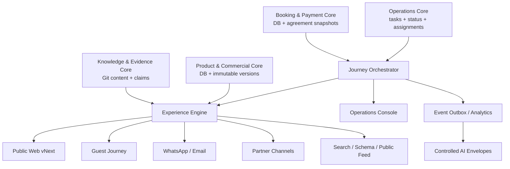

# JVTO Operating Ecosystem — Technical Project Handoff

> **Status:** [Inference] Standalone implementation authority for transforming the verified `jvto-web/main` baseline into the JVTO Operating Ecosystem target defined in this document.
>
> **Audience:** senior engineer, technical lead, product engineer, or AI coding agent.
>
> **Snapshot date:** 2026-08-05 UTC.
>
> **Primary repository:** `jvto-devteam/jvto-web`.
>
> **Authority rule:** when this handoff conflicts with approved canonical data in the current repository, the repository's current canonical source and an explicit owner decision take precedence. Do not resolve high-stakes factual conflicts automatically.

---

## 1. Mission

Transform JVTO from a website with fragmented content, transactional logic, legacy resolvers, and multiple producer repositories into a coherent operating ecosystem in which:

1. every business domain has exactly one declared authority;
2. public knowledge is authored once and compiled into every public representation;
3. product, price, booking, payment, and operational state are versioned and traceable;
4. website, guest journey, WhatsApp/email, partner channels, operations, search, and AI consume controlled domain contracts;
5. historical bookings retain the exact product, price, and policy terms accepted at confirmation;
6. production promotion is owner-gated, exact-SHA verified, smoke-tested, and reversible;
7. legacy writers and readers are removed after zero-consumer proof.

The project is not a cosmetic website rebuild. The website is one experience surface over the JVTO platform.

---

## 2. Executive directive

### 2.1 Build this

- A modular JVTO platform inside the existing `jvto-web` codebase.
- A completed Public Knowledge & Evidence Core in `content/`.
- A Product & Commercial Core for packages, versions, prices, availability, and commercial rules.
- A Booking & Payment Core with immutable agreement snapshots.
- A Journey & Operations Core for pickup, health readiness, rooming, assignments, trip state, and exceptions.
- A Communications Core driven by domain events, not duplicated policy text.
- A Public Web vNext assembled from the same domain contracts.
- A Guest Journey surface and an Operations Console.
- Controlled partner-channel adapters and AI decision envelopes.
- A durable event/outbox mechanism, audit trail, observability, CI gates, and release runbook.

### 2.2 Do not build this

- A new universal CMS database for public narrative.
- A second public-content SSOT.
- A microservice fleet before module boundaries and load justify it.
- A generic SaaS dashboard aesthetic for the public site.
- An AI agent with raw database, repository, vector-store, margin, or PII access.
- An hourly cached checkout price or availability decision.
- A new route-by-route legacy migration program.
- Auto-merge, auto-promote, or ownerless production deployment.
- A public knowledge feed containing customer, medical, private crew, cost, or incident data.

---

## 3. Verified current-state baseline

The implementation team must refresh this section before coding. The following was verified against `jvto-web/main` on 2026-08-05.

### 3.1 Repository and runtime

- Default branch: `main`.
- Production branch: `live`.
- Auto-merge is disabled at repository level.
- Application runtime: Next.js `^16.0.8`, React `^19.2.1`, TypeScript, Prisma `^6.18.0`, PostgreSQL, Zod `^4.4.3`.
- Existing static-content stack: `gray-matter`, Zod, remark/rehype, repository-owned validators.
- Existing build command: `next build --turbopack`.
- Existing `prebuild`: `npm run content:check`.

### 3.2 Public-content migration

Already implemented:

- content loader and validation gates;
- shared entity files;
- Policy cluster cutover;
- Travel Guide hub plus five Path A routes;
- Why JVTO hub and five sub-pages;
- migrated-route ownership registry and CMS write block;
- preview SHA endpoint and Why JVTO smoke tests.

Still incomplete:

- Travel Guide deferred routes and 13 OKF-backed pages;
- Verify JVTO;
- static Team narrative composition;
- static Destination narrative composition;
- generated sitemap/knowledge outputs across all clusters;
- Blog relocation;
- global retirement of old readers/writers;
- static-content database retirement;
- Public Web redesign.

### 3.3 Active legacy paths

The current repository still includes sync commands for:

- trust bundle;
- package readiness;
- blog;
- itinerary intelligence;
- policy bundle;
- CMS seed;
- OKF.

The consolidated artifact workflow still consumes `llm-wiki` and `knowledge-catalog-jvto-bootstrap`. Public-content-related syncs must be retired only after their public consumers are zero. Operational-intelligence producers may remain if they have a clear non-public authority contract.

### 3.4 Branch topology blocker

Verified compare state at handoff creation:

- `main` is 342 commits ahead of `live`;
- `main` is 124 commits behind `live`;
- compare status: `diverged`.

No destructive cutover or production branch replacement may occur before live-only behavior and data dependencies are audited and explicitly ported or rejected.

### 3.5 Database baseline

The Prisma schema already contains substantial booking, itinerary, hotel, crew, destination, add-on, financial, content, EAV, and narrative-claim structures. Do not design a greenfield database without first producing:

- model inventory;
- row-count and nullability profile;
- foreign-key map;
- write-path inventory;
- read-path inventory;
- webhook/payment dependencies;
- production-only migration history;
- PII and financial-data classification.

The database may contain legacy columns and naming irregularities. The transformation must use expand–migrate–contract rather than a rewrite-in-place.

### 3.6 Architecture decision register

This handoff is self-contained. No auxiliary planning artifact is required to interpret the following decisions.

| Architecture question | Decision | JVTO implementation rule |
|---|---|---|
| Where stable public knowledge lives | **Git-owned content authority** | `content/` owns evergreen public knowledge; PostgreSQL/provider events own transactional truth. “SSOT” applies per domain, not to one universal datastore. |
| How duplicated public sources are removed | **Controlled replacement** | Import and adjudicate public facts once, freeze old public writers, switch all consumers, prove zero use, then archive/delete with owner approval. |
| How public content is represented | **Validated Markdown/JSON** | Extend the content loader and Zod validation already present. Replace the loader only when a measured capability gap and parity tests justify it. |
| Which framework behavior is authoritative | **Installed repository version** | The repository uses Next.js `^16.0.8`. Implement and test against the installed lockfile version, not examples written for another release. |
| How stable public routes render | **Static/server rendering where appropriate** | Pre-render enumerable evergreen routes. Missing canonical content fails validation or resolves to 404; it must not silently query a legacy source. |
| Whether cached price/availability can confirm a transaction | **No** | Caching may improve display performance, but quote, checkout, availability, and payment decisions require a fresh authoritative read and visible timestamp/expiry. |
| How answer-oriented content is composed | **People-first semantic HTML** | Put a direct summary after H1 and direct answers next to real customer questions. Do not manufacture thin question pages or rewrite everything purely for AI. |
| How JSON-LD is maintained | **Generated projection** | Generate it from the same entity/claim/page graph as visible HTML; validate parity and safe serialization. Schema is not an independent fact store. |
| Whether a public machine feed is authoritative | **No; versioned projection only** | Generate a privacy-filtered feed for declared consumers. It never overrides the public knowledge or transactional authorities. |
| How canonical, sitemap, robots, and crawler controls are produced | **Generated policy outputs** | Generate from the route registry and owner policy. Preview stays `noindex`; production crawler controls are explicit and independently configurable. |
| When changed URLs are submitted for discovery | **After verified production deployment** | Submit changed production URLs only after exact-SHA verification. Queue/retry as best effort; receipt does not prove indexing. |
| Whether non-technical editing needs a CMS | **Deferred until measured need** | If later approved, the UI must write reviewed PRs/commits into `content/`, preserve CI/owner gates, and create no second store. |
| How duration is estimated | **Evidence-based milestones** | Estimate only after Milestone 0 establishes branch divergence, data quality, integrations, infrastructure, and available staffing. |
| Whether the old system is retained | **No, after safe cutover** | Freeze → migrate → switch → verify production → prove zero consumers → rollback window → archive/delete. No indefinite dual authority remains. |
| How AEO/GEO success is judged | **Measured business outcome** | Do not use visibility forecasts as acceptance criteria. Measure crawl/index coverage, answer accuracy, qualified demand, and conversion. |

This matrix is binding unless an Architecture Decision Record and owner approval replace a decision.

---

## 4. Binding principles

### P-01 — One authority per domain

There is no single storage system for the whole company. There is one declared authority for each domain.

### P-02 — Public knowledge is Git-owned

Evergreen public narrative, stable entities, evidence metadata, public policy, visible FAQ, destination guidance, public team biographies, and editorial content live under `content/`.

### P-03 — Transactional state is database-owned

Price, availability, quotation, booking, payment, customer, traveler, crew assignment, operational task, trip state, and audit records live in PostgreSQL.

### P-04 — Historical agreements are immutable snapshots

A booking stores the exact product version, price breakdown, policy version, and relevant knowledge commit accepted at confirmation. Later public changes do not rewrite an existing agreement.

### P-05 — Generated outputs are not authored

HTML, metadata, canonical URLs, JSON-LD, sitemap, robots output, public knowledge feeds, message drafts, and documents are generated from domain models. Generated files are never upstream authorities.

### P-06 — Critical decisions use fresh data

Checkout price, availability, payment state, and booking confirmation must use fresh authoritative reads. Time-based ISR is not an authority for transactional decisions.

### P-07 — AI is a controlled consumer

AI receives a purpose-built decision envelope. It does not author facts, prices, policies, availability, bookings, payment state, medical data, or operational truth.

### P-08 — Public proof and private evidence are separated

Evidence metadata and approved public extracts may be published. Private documents, customer data, medical details, internal costs, credentials, and incident records remain protected.

### P-09 — Owner controls irreversible business actions

Merge and production promotion require owner approval. Database destructive migration, policy adjudication, credential publication, and legacy repository archival require explicit approval.

### P-10 — No claim of completion without proof

Completion reports must include tests, CI status, commit SHA, migration evidence, relevant endpoint checks, and rollback state.

---

## 5. Target architecture



### 5.1 Deployment form

Start as a modular monolith:

```text
jvto-web/
├── content/
│   ├── pages/
│   ├── entities/
│   ├── faqs/
│   └── evidence/
├── src/
│   ├── app/                    # Next.js routes and UI composition
│   ├── domains/
│   │   ├── knowledge/
│   │   ├── catalog/
│   │   ├── pricing/
│   │   ├── booking/
│   │   ├── payment/
│   │   ├── journey/
│   │   ├── operations/
│   │   ├── communications/
│   │   └── analytics/
│   ├── application/            # commands, queries, orchestrators
│   ├── infrastructure/         # Prisma, queues, providers, storage
│   ├── integrations/           # Xendit, WhatsApp, email, partners
│   └── presentation/           # shared renderers/read models
├── scripts/
├── tests/
│   ├── unit/
│   ├── contract/
│   ├── integration/
│   ├── e2e/
│   ├── migration/
│   └── smoke/
└── docs/architecture/
```

Do not move existing files mechanically into this tree. Establish module APIs, migrate importers, then relocate code when tests prove behavior.

---

## 6. Domain ownership matrix

| Domain | Authority | Primary consumers | Forbidden ownership |
|---|---|---|---|
| Public knowledge | `content/` Git files | Web, search, AI, sales, comms | Booking state, PII |
| Evidence registry | Git metadata + protected evidence storage | Verify pages, reviewers | Raw secrets, medical data |
| Product catalog | PostgreSQL versioned models | Web, quote, booking, partners | Long-form policy duplicates |
| Pricing | PostgreSQL price rules/versions | Quote, checkout, invoice | Static Markdown prices as authority |
| Availability | Operational/booking DB | Checkout, sales, ops | Cached page as authority |
| Itinerary intelligence | Approved deterministic release/interface | Product, quote, ops, agents | Live booking or PII |
| Booking | PostgreSQL | Guest, ops, payment, comms | Mutable public policy copy |
| Payment | Provider events + internal ledger | Booking, receipt, finance | Marketing copy |
| Journey readiness | PostgreSQL tasks/state | Guest, ops, comms | Public evidence |
| Crew assignment | PostgreSQL | Ops | Public biography narrative |
| Communications | Versioned templates + domain data | Email, WhatsApp | Independent policy facts |
| Analytics | Domain-event projection | Owner, marketing, ops | Transactional authority |
| AI runtime | Controlled envelopes | Public/sales/ops assistants | Raw repo/DB/vector output |

---

## 7. Canonical contracts

The types below are target contracts. Names may be adapted to repository conventions, but semantics may not be weakened.

### 7.1 Common primitives

```ts
type UUID = string;
type ISODate = string;       // YYYY-MM-DD
type ISODateTime = string;   // RFC 3339
type Currency = "IDR" | "USD" | string;

interface Money {
  currency: Currency;
  amountMinor: bigint;
}

interface VersionRef {
  id: string;
  version: number;
  effectiveFrom: ISODateTime;
  effectiveTo?: ISODateTime;
}

interface SourceProvenance {
  sourceType: "git" | "database" | "provider" | "derived";
  sourceId: string;
  sourceVersion: string;
  generatedAt?: ISODateTime;
}
```

### 7.2 Knowledge and evidence

```ts
interface EvidenceRef {
  id: string;
  title: string;
  visibility: "public" | "public-redacted" | "internal" | "restricted";
  canonicalUrl?: string;
  contentHash?: string;
  issuedBy?: string;
  issuedAt?: ISODate;
  verifiedAt: ISODate;
}

interface PublicClaim {
  id: string;
  statement: string;
  shortAnswer?: string;
  status: "draft" | "review" | "published" | "retired";
  risk: "low" | "commercial" | "legal" | "medical" | "safety";
  owner: string;
  ownerRoute: string;
  evidenceRefs: string[];
  relatedEntityRefs: string[];
  lastReviewed: ISODate;
  reviewedBy: string;
  allowedSurfaces: Array<"web" | "faq" | "schema" | "feed" | "sales" | "operations">;
}

interface PublicPageModel {
  route: string;
  title: string;
  browserTitle?: string;
  description: string;
  summary: string;
  sections: PublicSection[];
  answerBlocks?: Array<{ question: string; directAnswer: string; detailSectionRef?: string }>;
  faqRefs: string[];
  entityRefs: string[];
  claimRefs: string[];
  schemaTypes: string[];
  lastReviewed: ISODate;
  status: "draft" | "published" | "retired";
}
```

Rules:

- `route` is unique and canonical.
- `title` renders the only H1.
- `summary` gives the primary answer/value proposition without requiring interaction.
- `answerBlocks` are used only for genuine customer questions and remain visible in the rendered HTML.
- visible FAQ and any retained FAQ semantic markup share one object.
- high-risk claims require evidence and an explicit reviewer.
- schema builders resolve entity/claim references; they do not duplicate values.
- Git commit date is not `lastReviewed`.

### 7.3 Product and commercial

```ts
interface TourProductVersion {
  productId: UUID;
  version: number;
  slug: string;
  status: "draft" | "active" | "retired";
  publicContentRef: string;
  itineraryReleaseRef: string;
  originRefs: string[];
  destinationRefs: string[];
  durationDays: number;
  durationNights: number;
  privateOnly: boolean;
  inclusionRuleRefs: string[];
  exclusionRuleRefs: string[];
  healthRequirementRefs: string[];
  cancellationPolicyRef: string;
  paymentPolicyRef: string;
  validFrom: ISODateTime;
  validTo?: ISODateTime;
}

interface PriceQuote {
  quoteId: UUID;
  productVersionRef: VersionRef;
  pax: number;
  travelDates: { start: ISODate; end: ISODate };
  lineItems: QuoteLineItem[];
  subtotal: Money;
  discount?: Money;
  total: Money;
  depositRequired: Money;
  expiresAt: ISODateTime;
  priceVersion: string;
  generatedAt: ISODateTime;
}
```

Rules:

- product marketing copy may reference public content, but product identity/version lives in the catalog;
- checkout recalculates or validates the quote against fresh rules;
- price shown publicly includes an `asOf` or quote-expiry context;
- internal costs and margins never enter public or AI envelopes;
- add-ons are versioned and snapshotted at booking.

### 7.4 Booking and agreement snapshot

```ts
type BookingStatus =
  | "inquiry"
  | "quoted"
  | "pending_deposit"
  | "confirmed"
  | "details_incomplete"
  | "operationally_ready"
  | "in_progress"
  | "completed"
  | "cancelled";

interface BookingAgreementSnapshot {
  bookingId: UUID;
  productId: UUID;
  productVersion: number;
  itineraryReleaseRef: string;
  priceQuote: PriceQuote;
  policyVersions: Array<{ policyId: string; version: string; sourceCommit?: string }>;
  publicKnowledgeCommit: string;
  acceptedAt: ISODateTime;
  acceptedByCustomerId: UUID;
  checksum: string;
}

interface Booking {
  id: UUID;
  reference: string;
  channel: "direct" | "whatsapp" | "agency" | "klook" | "getyourguide" | string;
  externalReference?: string;
  status: BookingStatus;
  customerId: UUID;
  travelerIds: UUID[];
  agreementSnapshotId: UUID;
  startDate: ISODate;
  endDate: ISODate;
  pax: number;
  createdAt: ISODateTime;
  updatedAt: ISODateTime;
}
```

Rules:

- changing a product or policy creates a new version;
- existing booking agreements remain unchanged;
- every status transition is validated and audited;
- booking imports use idempotency on `(channel, externalReference)`;
- customer-facing references never expose sequential database IDs.

### 7.5 Payment ledger

```ts
type PaymentStatus = "pending" | "authorized" | "paid" | "failed" | "expired" | "refunded";

interface PaymentRecord {
  id: UUID;
  bookingId: UUID;
  provider: "xendit" | "bank_transfer" | "wise" | "cash" | string;
  providerReference?: string;
  purpose: "deposit" | "installment" | "balance" | "refund";
  amount: Money;
  status: PaymentStatus;
  idempotencyKey: string;
  occurredAt?: ISODateTime;
  recordedAt: ISODateTime;
}
```

Rules:

- provider webhook payloads are verified, stored safely, deduplicated, and projected into the ledger;
- payment totals are derived from immutable ledger records, not manually overwritten totals;
- booking confirmation follows an explicit payment/approval rule;
- failed notification delivery does not roll back a valid payment record.

### 7.6 Journey and operations

```ts
type JourneyTaskType =
  | "pickup_details"
  | "flight_details"
  | "health_screening"
  | "rooming"
  | "traveler_details"
  | "balance_payment"
  | "crew_assignment"
  | "vehicle_assignment"
  | "partner_confirmation"
  | "predeparture_briefing";

interface JourneyTask {
  id: UUID;
  bookingId: UUID;
  type: JourneyTaskType;
  status: "not_required" | "required" | "pending" | "submitted" | "verified" | "waived";
  dueAt?: ISODateTime;
  assignedRole: "guest" | "sales" | "operations" | "finance" | "medical-review";
  publicSummary?: string;
  privatePayloadRef?: string;
  ruleVersion: string;
  completedAt?: ISODateTime;
}
```

Rules:

- task requirements are derived from product, dates, origin/destination, and approved rules;
- health requirement status is visible to the guest and ops, while medical details remain restricted;
- operational readiness is computed from required tasks, not a free-text checkbox;
- manual overrides require actor, reason, timestamp, and audit record.

### 7.7 Events and outbox

```ts
interface DomainEvent<T> {
  eventId: UUID;
  eventType: string;
  aggregateType: string;
  aggregateId: UUID;
  aggregateVersion: number;
  occurredAt: ISODateTime;
  actorId?: UUID;
  correlationId: UUID;
  causationId?: UUID;
  payload: T;
  schemaVersion: number;
}
```

Required initial events:

```text
inquiry.created
quote.issued
quote.expired
booking.created
booking.confirmed
booking.amended
deposit.requested
deposit.paid
balance.due
payment.failed
pickup.required
pickup.confirmed
health.required
health.completed
crew.assigned
vehicle.assigned
trip.ready
trip.started
trip.completed
review.requested
communication.requested
communication.sent
communication.failed
```

Write business state and the outbox event in one database transaction. A worker processes events with retries and idempotent handlers.

### 7.8 Application commands and queries

Domain behavior is invoked through application services, not direct Prisma calls from pages, route handlers, message templates, or AI adapters.

Initial commands:

```text
CreateQuote
ExpireQuote
CreateBooking
ImportChannelBooking
AmendBooking
AcceptBookingAgreement
RecordPaymentProviderEvent
ApproveManualPayment
RequestRefund
RequireJourneyTask
SubmitJourneyTask
VerifyJourneyTask
WaiveJourneyTask
AssignCrew
AssignVehicle
MarkTripReady
StartTrip
CompleteTrip
RequestCommunication
ResolveIntegrationException
```

Initial queries/read models:

```text
GetPublicPage
ListPublicRoutes
GetPublicProduct
ListPublicProducts
GetFreshQuoteContext
GetBookingAgreement
GetBookingBalance
GetGuestJourney
GetOperationsReadiness
ListOperationsExceptions
GetPublicOperationalStatus
GetAgentDecisionEnvelope
```

Command rules:

- authenticate and authorize before domain execution;
- validate input at the boundary;
- load and mutate through the owning domain repository;
- enforce aggregate/version invariants;
- write audit/outbox records in the same transaction where applicable;
- return typed results and stable error codes;
- never let presentation code mutate Prisma directly.

### 7.9 HTTP/API surface

Do not create network APIs for code that can remain an internal server-side application call. Expose HTTP only for browser clients, external providers, partner integrations, or independently authenticated surfaces.

Illustrative target routes:

```text
GET  /api/public/v1/pages/{route}
GET  /api/public/v1/products
GET  /api/public/v1/products/{slug}
GET  /api/public/v1/operational-status
POST /api/public/v1/quotes
POST /api/public/v1/bookings

GET  /api/guest/v1/bookings/{reference}
GET  /api/guest/v1/bookings/{reference}/journey
POST /api/guest/v1/bookings/{reference}/tasks/{taskId}/submit

GET  /api/ops/v1/readiness
GET  /api/ops/v1/exceptions
POST /api/ops/v1/bookings/{id}/assignments
POST /api/ops/v1/tasks/{id}/verify
POST /api/ops/v1/tasks/{id}/waive

POST /api/integrations/v1/xendit/webhook
POST /api/integrations/v1/channels/{channel}/bookings
```

API rules:

- version external contracts;
- use opaque identifiers;
- define idempotency headers for retryable write requests;
- use stable machine-readable error codes;
- do not expose internal Prisma shapes;
- paginate collections;
- return freshness timestamps for price, availability, and status;
- apply `Cache-Control` by data class;
- verify webhook signatures before normalization;
- store provider receipt metadata before business projection;
- document authentication and authorization per route;
- use consistent correlation IDs across request, event, communication, and provider calls.

Illustrative error envelope:

```ts
interface ApiProblem {
  type: string;
  title: string;
  status: number;
  code: string;
  detail?: string;
  requestId: string;
  fieldErrors?: Record<string, string[]>;
}
```

---

## 8. Experience Engine

The Experience Engine composes domain read models. It is not an authority and cannot invent missing facts.

### 8.1 Public-page composition

```ts
interface PublicTourExperience {
  page: PublicPageModel;
  product: TourProductVersion;
  displayPrice?: { value: Money; asOf: ISODateTime; quoteRequired: boolean };
  availability?: { state: "available" | "request" | "unavailable" | "unknown"; asOf: ISODateTime };
  operationalStatus?: PublicOperationalStatus;
  schemas: Record<string, unknown>[];
  actions: ExperienceAction[];
}
```

### 8.2 Caching matrix

| Data | Strategy |
|---|---|
| Public narrative/entities | build-time/static, commit-addressable |
| Public knowledge feed | generated per successful production artifact |
| Product structure | versioned read, cache/tag invalidation allowed |
| Display price | short-lived/request-time read with `asOf` |
| Checkout price | no stale authority; fresh validation |
| Availability | fresh read or explicitly `unknown/request` |
| Operational public status | event/tag revalidation, visible timestamp |
| Booking/payment | authenticated no-store transactional reads |
| Guest journey | authenticated, role-scoped, no shared cache |

### 8.3 Public Web vNext information architecture

Preserve canonical route families unless an owner-approved redirect map exists:

```text
/
/tours
/tours/...
/destinations
/destinations/...
/why-jvto
/why-jvto/...
/verify-jvto
/verify-jvto/...
/travel-guide
/travel-guide/...
/policy
/blog
/contact
```

Customer journey:

1. Discover destinations.
2. Compare and choose a private itinerary.
3. Verify JVTO, people, evidence, and operating standards.
4. Understand preparation, health, pickup, luggage, and closure rules.
5. Obtain a fresh quote or use the supported booking path.
6. Confirm payment and complete trip-readiness tasks.
7. Manage the confirmed journey.

### 8.4 Page composition standard

Every high-value page should support the following where relevant:

- one H1;
- direct summary below H1;
- stable canonical URL;
- clear primary entity/product;
- concise answer blocks for actual customer questions;
- narrative detail and cause/effect explanation;
- visible evidence/provenance;
- tables for factual comparison only;
- visible FAQ where useful;
- applicable JSON-LD generated from the same graph;
- `lastReviewed` and owner route;
- internal links to the authority page;
- one primary conversion action and one assistance action.

Do not force every heading into question form. Do not hide trust proof behind interaction-only UI.

### 8.5 Visual direction

Public design direction:

```text
premium expedition × operational authority × volcanic expertise
```

Avoid:

- SaaS/dashboard visual language on public pages;
- playful generic travel-blog styling;
- sterile corporate templates;
- resort-luxury positioning;
- abstract visuals disconnected from bookable journeys.

Public components should include route maps, itinerary timelines, operational-certainty panels, evidence cards, preparation modules, status timestamps, inclusion clarity, and persistent contextual actions.

Internal Operations Console prioritizes task clarity, exceptions, deadlines, and auditability over the public brand aesthetic.

---

## 9. Search, schema, and public machine outputs

### 9.1 AEO/GEO engineering position

For JVTO, AEO/GEO is not a separate content system and has no “AI-only schema.” It is the observable result of:

- useful non-commodity knowledge based on JVTO's real operations and evidence;
- crawlable, server-rendered, semantic HTML;
- one canonical fact/claim graph across visible copy and generated outputs;
- stable routes, internal links, metadata, and sitemap membership;
- accurate structured data that mirrors visible content;
- explicit review dates and provenance for consequential claims;
- fast, accessible pages and clear conversion paths;
- independent crawler policy for search inclusion versus model training.

The system must optimize for human decision quality first. Search visibility, AI citation, and referrals are measured outcomes, not promises made by the architecture.

### 9.2 HTML is primary

Important public content must be present in server-rendered textual HTML. Search/AI files are secondary outputs.

For relevant pages, the initial HTML must preserve this adjacency:

```html
<main>
  <article>
    <h1>Clear page subject</h1>
    <p>Direct, useful summary.</p>

    <section aria-labelledby="real-question">
      <h2 id="real-question">A real customer question?</h2>
      <p>A direct answer that stands on its own.</p>
      <p>Supporting operational detail, limits, evidence, and next action.</p>
    </section>
  </article>
</main>
```

This is a composition standard, not a requirement to turn every heading into a question or create pages for every query variation.

### 9.3 Entity graph

Use stable `@id` values:

```text
/#organization
/#website
/team/{slug}#person
/destinations/{slug}#place
/tours/{slug}#trip
/travel-guide/{slug}#guide
/verify-jvto/{slug}#document
```

Schema builders resolve canonical entities and claims. They must not contain independent names, counts, credentials, policies, or answers.

### 9.4 Schema policy

- Use Organization/TravelAgency and WebSite only when semantically accurate.
- Use Person/ProfilePage only for real public profile pages.
- Use TouristTrip/TouristDestination/TouristAttraction as semantic types where accurate; do not claim a Google rich-result entitlement.
- FAQPage is optional semantic output, not a Google rich-result KPI. If retained, it must match visible FAQ exactly.
- Structured data must never include hidden claims or private evidence.
- Serialize JSON-LD safely and test the initial HTML response.

### 9.5 Public feed

Target:

```text
/knowledge/jvto.json
```

Envelope:

```ts
interface PublicKnowledgeFeed {
  schemaVersion: string;
  sourceCommit: string;
  generatedAt: ISODateTime;
  canonicalOrigin: string;
  entities: unknown[];
  claims: PublicClaim[];
  policies: unknown[];
  destinations: unknown[];
  products: unknown[];
}
```

The feed is a convenience/product interface. Do not claim automatic ingestion or ranking preference by external search/AI providers.

Google-specific AEO/GEO must not depend on `llms.txt`, OKF, or this feed. Current official Google guidance says no special AI markup or AI text file is required; ordinary search quality, crawlability, useful content, and visible/schema consistency remain the foundation. The feed exists only for explicitly supported JVTO/B2B/AI consumers.

### 9.6 Crawler controls

- production allows intended search crawlers;
- preview/help remains `noindex`;
- configure OAI-SearchBot independently from GPTBot according to owner policy;
- CDN/firewall must not unintentionally block approved crawler IP ranges;
- crawler logs indicate access, not citation or recommendation.

Record the owner policy separately for automated search discovery and foundation-model training. OAI-SearchBot and GPTBot are independent controls; do not infer one policy from the other.

### 9.7 IndexNow

Implement only as a retryable post-production notification:

```text
successful production deploy
→ exact SHA verified
→ changed canonical URL manifest resolved
→ submit production URLs
→ record response
```

- Do not run on preview or every Git commit.
- HTTP 200 means received, not indexed.
- Failure does not roll back a healthy deployment.

### 9.8 Search and AI measurement

Measure the complete path, not vanity crawler activity:

| Layer | KPI | Interpretation |
|---|---|---|
| Integrity | visible/schema/feed claim parity; stale review count | Whether every representation still expresses the same approved truth |
| Discovery | crawl success; indexed canonical coverage; sitemap errors | Whether machines can reach and retain intended pages |
| Retrieval | query/page impressions; AI-feature visibility where provider reporting exists | Whether content participates in relevant retrieval |
| Answer quality | sampled factual-answer accuracy with cited source | Whether machines reproduce JVTO facts correctly |
| Demand | qualified organic/AI referral sessions and inquiries | Whether discovery produces relevant visitors |
| Business | quote, deposit, and confirmed-booking conversion by attributable source | Whether visibility contributes to revenue |

“Share of Model” may be sampled as a directional research metric, but is not a deployment gate or causal revenue metric.

---

## 10. Communications orchestration

### 10.1 Template model

```ts
interface CommunicationTemplate {
  id: string;
  version: number;
  channel: "email" | "whatsapp" | "document";
  triggerEvent: string;
  locale: string;
  subject?: string;
  bodyTemplate: string;
  requiredData: string[];
  policyRefs: string[];
  status: "draft" | "active" | "retired";
}
```

Templates may phrase domain data but may not redefine:

- deposit rules;
- payment deadlines;
- cancellation/reschedule terms;
- inclusion/exclusion;
- health requirements;
- pickup requirements;
- partner claims.

Transactional and marketing communications are separate purposes. Marketing messages require the applicable lawful basis, preference/consent record where required, and auditable opt-out handling. Opting out of marketing must not suppress necessary booking, payment, safety, or trip-operation messages.

### 10.2 Delivery semantics

- Event handler creates a communication request.
- Renderer resolves a template version and controlled read model.
- Provider adapter sends with idempotency key.
- Delivery status is recorded.
- Failure is retried with a bounded policy.
- Exhausted retries create an operations exception.
- Manual resend is audited.

### 10.3 Message provenance

Every sent message stores:

- template ID/version;
- domain snapshot references;
- recipient channel;
- actor/automation;
- correlation ID;
- provider ID;
- sent timestamp;
- delivery status.

---

## 11. Partner-channel integration

Use adapters; do not create separate booking logic per partner.

```ts
interface ChannelBookingAdapter {
  channel: string;
  verifySignature(input: unknown): Promise<boolean>;
  normalize(input: unknown): Promise<NormalizedChannelBooking>;
  deduplicate(input: NormalizedChannelBooking): Promise<Booking | null>;
  createOrAmend(input: NormalizedChannelBooking): Promise<Booking>;
}
```

Required controls:

- stable crosswalk between external product IDs and internal product versions;
- idempotency on external booking/amendment reference;
- explicit amendment history;
- unknown-product quarantine;
- currency and amount validation;
- pickup/language/pax extraction;
- no silent overwrite of a manually amended booking;
- human exception queue for incomplete or contradictory payloads.

---

## 12. AI architecture

### 12.1 Separation of assistants

| Assistant | Allowed data | Forbidden data/actions |
|---|---|---|
| Public travel advisor | published knowledge, public product read models, safe status | PII, internal cost, booking mutation |
| Sales copilot | inquiry, approved product/quote tools, public policy | raw DB, direct payment mutation |
| Operations copilot | role-scoped booking/journey envelope | public model training dump, unrestricted medical data |
| Content copilot | repository content, validation output, evidence metadata | direct publish/merge, fact invention |

### 12.2 Decision envelope

```ts
interface AgentDecisionEnvelope {
  envelopeVersion: string;
  purpose: "public-answer" | "sales" | "operations" | "content-review";
  requestId: UUID;
  allowedActions: string[];
  knowledgeRelease: string;
  itineraryRelease?: string;
  productReadModel?: unknown;
  bookingReadModel?: unknown;
  policyRefs: string[];
  safetyBoundaries: string[];
  missingFields: string[];
  humanHandoffRequired: boolean;
  expiresAt: ISODateTime;
}
```

Rules:

- adapters construct the envelope;
- the model never receives raw repository traversal, raw SQL results, or unrestricted vector matches;
- unavailable live data is represented as unknown, never guessed;
- high-stakes medical, legal, safety, price, availability, refund, or booking decisions use deterministic tools or human approval;
- every tool call and final action is auditable;
- customer-facing traffic remains disabled until evaluation gates pass.

---

## 13. Security, privacy, and authorization

### 13.1 Data classes

| Class | Examples | Handling |
|---|---|---|
| Public | published pages, public credentials, tour descriptions | CDN/public cache allowed |
| Internal | operational rules, non-public partner mapping | authenticated staff only |
| Confidential | customer contact, booking details, financial records | encrypted, role-scoped, audited |
| Restricted | medical documents, secrets, provider credentials | minimum-access role, no analytics payload |

### 13.2 Required controls

- role-based authorization at application-service boundaries;
- server-side authorization for every authenticated query and command;
- secrets outside Git;
- verified webhook signatures;
- idempotency and replay protection;
- CSRF/session protections appropriate to the auth mechanism;
- rate limits for public write endpoints;
- PII redaction in logs and error reports;
- encryption in transit and at rest according to infrastructure capability;
- immutable audit records for high-risk mutations;
- data retention and deletion policy;
- purpose and lawful-basis inventory for personal-data processing;
- explicit consent/preference records where consent is the approved basis, including timestamp, scope, source, and withdrawal;
- separation between marketing preferences and required booking/operational communications;
- dependency and secret scanning in CI;
- backup/restore test before destructive migrations.

### 13.3 Medical-data boundary

Public knowledge may state approved health requirements and public verification. Traveler health documents or screening results must not be placed in:

- Git;
- public knowledge feed;
- analytics events;
- search schema;
- general AI context;
- communication logs beyond minimum status/reference.

---

## 14. Database transformation strategy

### 14.1 Mandatory pre-migration audit

Before altering Prisma models:

1. introspect production schema;
2. compare it with `prisma/schema.prisma`;
3. list all application read/write paths;
4. identify triggers, constraints, views, and raw SQL;
5. capture row counts and orphan/null profiles;
6. classify PII/financial/medical fields;
7. identify external IDs and duplicate risks;
8. verify backup and restore procedure;
9. record current production migration version;
10. produce an owner-readable destructive-change list.

### 14.2 Expand–migrate–contract

For each domain migration:

1. **Expand:** add new tables/columns/indexes without removing old ones.
2. **Backfill:** deterministic, resumable, batched data migration.
3. **Verify:** counts, checksums, invariants, sampled records.
4. **Switch reads:** feature flag or versioned repository implementation.
5. **Switch writes:** one authoritative write path; avoid indefinite dual-write.
6. **Observe:** monitor errors, drift, and business invariants.
7. **Contract:** delete old fields/tables only after zero-reference proof and owner approval.

### 14.3 New supporting tables

Names are illustrative and must be adapted after schema audit:

```text
product_versions
price_rule_versions
quote_snapshots
booking_agreement_snapshots
booking_status_history
payment_ledger
journey_tasks
journey_task_history
domain_outbox
communication_requests
communication_deliveries
integration_receipts
audit_log
```

Do not introduce all tables in one migration. Add them per bounded capability with backward-compatible migrations.

---

## 15. Legacy retirement inventory

The implementation team must generate an actual reference report. Expected legacy categories include:

- manual page snapshots;
- CMS seed public pages/sections;
- `content_pages` public narrative reads/writes;
- FAQ-manager snapshots/resolvers;
- public narrative in TSX;
- duplicated schema constants;
- hardcoded public route registries where derivable;
- llm-wiki public blog sync;
- trust/policy/OKF public-content consumers;
- manually maintained public knowledge outputs;
- old CMS edit paths for Git-owned routes;
- superseded frontend components;
- live-only production behavior not represented in `main`.

Retirement rule:

```text
source frozen
→ all consumers mapped
→ replacement read/write path active
→ preview verified
→ production verified
→ zero-reference scan
→ rollback window elapsed
→ delete/archive with owner approval
```

Operational artifacts such as itinerary intelligence or package readiness are not automatically legacy. Preserve them if they retain a declared operational authority and controlled interface.

---

## 16. Implementation program

This program replaces ad-hoc case-by-case work. It uses system-level milestones with explicit entry and exit gates.

### Milestone 0 — Control plane and production baseline

**Goal:** create a safe baseline before changing architecture.

Tasks:

- stop parallel executors and scheduled coding work;
- verify current open PRs, branches, workflow subscriptions, and deployments;
- merge only previously approved governance work;
- audit `main` versus `live`, including 124 live-only commits;
- classify live-only changes as preserve, duplicate, obsolete, or unknown;
- port valid live-only behavior to a reconciliation branch from current `main`;
- establish exact preview and production SHA endpoints;
- document backup/restore and deploy rollback;
- freeze new public-content writers in old producer paths;
- create a current source/consumer manifest.

Exit criteria:

- `main` contains every intentionally retained production behavior;
- production is not yet changed;
- source/consumer manifest covers all public routes and generated surfaces;
- owner receives reconciliation evidence and rollback plan.

### Milestone 1 — Architecture foundation

**Goal:** establish module boundaries and shared contracts without changing behavior.

Tasks:

- create domain/application/infrastructure module boundaries;
- add common IDs, money, version, provenance, event, and error contracts;
- add architecture dependency tests;
- implement outbox schema and worker skeleton behind a disabled flag;
- implement audit-log interface;
- add feature-flag mechanism;
- add correlation IDs and structured logging;
- write Architecture Decision Records for ownership, snapshots, events, caching, and AI envelopes.

Exit criteria:

- no runtime behavior change;
- contracts compile;
- dependency tests block forbidden cross-domain imports;
- outbox integration test passes;
- rollback is code-only.

### Milestone 2 — Public Knowledge Core completion

**Goal:** complete the public knowledge authority globally.

Tasks:

- migrate deferred Travel Guide, Verify, Team narrative, Destination narrative, and Blog;
- consolidate canonical entities, claims, FAQ, evidence metadata, and owner routes;
- build one Public Knowledge Compiler;
- generate metadata, canonical, schema, sitemap, and public feed from the compiler;
- remove public DB/seed/snapshot/OKF/blog/hardcoded fallbacks per migrated cluster;
- expand ownership CI from route lists to all public surfaces;
- validate visible/schema parity and evidence referential integrity;
- retain public route URLs.

Exit criteria:

- every evergreen public route reads through the knowledge compiler;
- zero public narrative reads from Prisma;
- zero public narrative hardcoded in TSX;
- public feed records exact source commit;
- preview critical-route matrix passes;
- old public writer paths are frozen.

### Milestone 3 — Product & Commercial Core

**Goal:** make one versioned product model usable by website, quotes, booking, partners, and operations.

Tasks:

- inventory existing packages, activities, destinations, add-ons, hotel/rooming, and prices;
- define product/version and commercial-rule model;
- map current product IDs/slugs and external channel IDs;
- build deterministic quote service;
- implement quote expiry and price-version validation;
- expose public product read models without internal costs;
- compose stable product narrative from Knowledge Core;
- add fresh price/availability queries for conversion surfaces;
- capture anomalies and unmapped records in an exception report, never silently coerce them.

Exit criteria:

- one internal product ID maps each active public/channel product;
- quotes are reproducible from stored inputs and version;
- checkout rejects stale/invalid quotes deterministically;
- public price never exposes internal expense/margin;
- current website remains functional behind existing paths.

### Milestone 4 — Booking & Payment Core

**Goal:** create a versioned, auditable commercial agreement and payment ledger.

Tasks:

- define booking state machine and transition rules;
- create immutable agreement snapshots;
- migrate existing booking references and product associations;
- implement payment ledger and provider-receipt ingestion;
- verify webhook signatures and idempotency;
- derive paid/deposit/balance status from ledger;
- generate invoice/receipt from agreement and payment records;
- retain amendment history for pax, room, add-on, dates, and price;
- reconcile public policy with operational receipt behavior through explicit owner adjudication before activation.

Exit criteria:

- duplicate webhook replay does not duplicate payment or booking state;
- existing paid balances reconcile to source records;
- historical booking terms are immutable;
- cancellation/reschedule behavior uses one approved rule version;
- financial migration report is owner-reviewed.

### Milestone 5 — Journey & Operations Core

**Goal:** compute trip readiness and manage operational exceptions.

Tasks:

- implement JourneyTask and readiness projection;
- derive pickup, flight, traveler, health, rooming, balance, partner, crew, vehicle, and briefing tasks;
- integrate deterministic itinerary intelligence through a versioned adapter;
- implement assignment and conflict checks;
- implement closure/status impacts and plan-B task generation;
- create operations exception queue;
- build guest-safe and staff read models;
- audit overrides and waivers.

Exit criteria:

- each confirmed booking has a deterministic readiness result;
- missing requirements are explicit tasks;
- restricted data is not exposed in guest/public read models;
- manual overrides are traceable;
- ops can identify why a trip is not ready without reading free-text history.

### Milestone 6 — Communications and channel adapters

**Goal:** drive communications and external bookings from the same domain state.

Tasks:

- version message templates;
- connect event-triggered email and WhatsApp requests;
- record delivery and retry state;
- add GetYourGuide/Klook/agency adapters according to available contracts;
- implement product/channel crosswalk;
- normalize amendments and pickup/language/pax details;
- quarantine unknown or contradictory payloads;
- provide audited manual resolution.

Exit criteria:

- no template independently defines policy/price/requirements;
- resend/retry is idempotent;
- external amendment does not silently erase local changes;
- channel exceptions are operationally visible.

### Milestone 7 — Public Web vNext, Guest Journey, and Operations Console

**Goal:** deliver the new experience layer without duplicating domain truth.

Tasks:

- implement design system and public page composition;
- build destination, tour, trust, verify, guide, policy, and contact journeys;
- integrate fresh price/availability read models;
- implement quote/booking entry paths;
- build authenticated Guest Journey;
- build role-scoped Operations Console;
- add accessibility, performance, SEO, schema, and conversion tests;
- deploy to preview under exact SHA.

Exit criteria:

- canonical route contract passes;
- critical public content exists in initial HTML;
- booking-critical data is fresh and timestamped;
- guest cannot access another booking;
- ops permissions are role-scoped;
- owner accepts visual and functional preview.

### Milestone 8 — Controlled production cutover and legacy purge

**Goal:** switch production, verify exact behavior, then remove unreachable legacy.

Tasks:

- create owner-triggered exact-SHA promotion;
- record previous production SHA;
- deploy production artifact;
- verify `/api/build-info` or equivalent;
- run critical public, booking, payment, guest, and ops smoke tests;
- observe business/error metrics during rollback window;
- submit changed production URLs to IndexNow as best effort;
- prove zero legacy consumers;
- delete static-content DB readers/writers and retired frontend/resolvers;
- archive old public producer pipelines/repositories as approved;
- contract obsolete DB tables only in a separate owner-approved migration.

Exit criteria:

- production serves the approved exact SHA;
- smoke and reconciliation checks pass;
- rollback to previous SHA has been tested;
- zero legacy runtime references;
- `live` is no longer an independent development line;
- owner approves final legacy deletion.

---

## 17. Pull-request and commit strategy

### 17.1 Rules

- One executor at a time.
- One milestone active at a time unless work is provably independent and owner-authorized.
- No giant cross-domain PR.
- No route-by-route content PR program.
- Each PR represents one system capability or safe migration step.
- No mixed refactor, data migration, redesign, and production change in one PR.
- Database destructive changes are isolated.
- Generated artifacts are included only when repository convention requires them.
- No auto-merge or auto-promote.

### 17.2 Required PR description

```text
Goal
Authority/domain changed
Current behavior
New behavior
Data migration
Security/privacy impact
Feature flag
Tests and commands
CI run
Preview SHA and endpoints
Rollback
Known risks
Explicit non-goals
READY FOR OWNER
```

### 17.3 Completion language

Use:

```text
IMPLEMENTED
PREVIEW-VERIFIED
PRODUCTION-VERIFIED
LEGACY-RETIRED
```

Do not use “done” without naming the achieved state.

---

## 18. Testing strategy

### 18.1 Unit tests

- domain invariants;
- money and totals;
- product version selection;
- quote expiry;
- booking state transitions;
- payment projection;
- readiness derivation;
- template rendering;
- schema builders;
- claim/evidence validation.

### 18.2 Contract tests

- external provider/channel fixtures;
- decision-envelope schema;
- public feed schema;
- domain event schema/version;
- public read-model compatibility;
- itinerary intelligence release compatibility.

### 18.3 Integration tests

- Prisma repositories against disposable PostgreSQL;
- outbox transaction and retry;
- webhook verification/idempotency;
- quote-to-booking snapshot;
- booking-to-journey task creation;
- payment-to-receipt communication;
- authorization boundaries.

### 18.4 Migration tests

- production-like anonymized fixtures;
- resumable backfill;
- counts/checksum invariants;
- old/new read comparison;
- rollback before contract phase;
- duplicate and orphan handling.

### 18.5 E2E tests

Critical journeys:

1. Discover tour → fresh quote → booking initiation.
2. Deposit payment webhook → confirmed booking → receipt.
3. Partner booking ingestion → missing pickup task.
4. Guest completes pickup/traveler details.
5. Ijen product derives health requirement without exposing medical data.
6. Ops assigns crew/vehicle and reaches trip-ready state.
7. Booking amendment preserves history and recalculates approved totals.
8. Policy/content update changes public output but not historical agreement.
9. Role/tenant isolation prevents unauthorized booking access.
10. Failed communication retries without duplicate business action.

### 18.6 Public content and search tests

- exactly one H1;
- direct summary follows the H1 on designated answer-first pages;
- genuine answer blocks are visible in initial HTML and keep question/answer adjacency;
- canonical route uniqueness;
- internal links;
- evidence references;
- visible/schema parity;
- stable entity `@id`;
- no forbidden claims;
- no private data in HTML/feed/schema;
- sitemap membership;
- preview noindex;
- production crawler policy;
- initial HTML contains critical content.
- crawler-policy tests distinguish search discovery from model-training controls.

### 18.7 Non-functional tests

- accessibility audit;
- responsive layout;
- Core Web Vitals/performance budget defined and measured;
- API latency/error baseline;
- concurrent webhook replay;
- backup restore drill;
- permission/security regression;
- structured log and correlation propagation.

---

## 19. CI/CD gates

Recommended order:

```text
1. install with lockfile
2. generated-client/schema check
3. architecture dependency check
4. content validation
5. canonical facts/evidence validation
6. TypeScript
7. lint gate
8. unit tests
9. contract tests
10. disposable-DB integration tests
11. migration dry run when relevant
12. Next.js full build
13. static HTML/schema/feed assertions
14. security/dependency/secret scan
15. preview deploy
16. preview smoke/E2E
17. exact-SHA report
```

Production workflow:

```text
owner selects approved main SHA
→ preflight gates
→ record previous production SHA
→ deploy immutable artifact
→ verify build-info SHA
→ run smoke tests
→ mark production verified
→ post-deploy notifications/IndexNow
```

Do not make IndexNow, analytics ingestion, or non-critical crawler telemetry a production rollback trigger.

---

## 20. Observability and audit

### 20.1 Structured log fields

```text
timestamp
level
service/module
requestId
correlationId
actorId (hashed/redacted where needed)
bookingId (opaque)
eventType
provider
result
errorCode
durationMs
commitSha
```

Never log payment secrets, raw medical content, full contact details, session tokens, or provider credentials.

### 20.2 Business health metrics

Integrity:

- duplicate canonical facts;
- missing/stale reviews;
- evidence reference failures;
- legacy-source references;
- public/schema mismatches.

Conversion:

- visit → inquiry;
- inquiry → quote;
- quote → deposit;
- assisted versus self-service booking;
- channel attribution.

Operational:

- bookings not ready;
- pickup incomplete;
- balance overdue;
- health task incomplete;
- assignment conflicts;
- manual override count;
- communication failures;
- partner payload exceptions.

Reliability:

- error rate;
- provider webhook lag;
- outbox backlog;
- failed retries;
- payment reconciliation differences;
- production SHA drift.

Search/AI:

- indexed canonical pages;
- Search Console trends;
- crawler access;
- identifiable referrals;
- sampled factual-answer evaluation.

Do not treat crawler hits or sampled Share of Model as direct booking impact without conversion evidence.

---

## 21. Rollback design

### Code/frontend rollback

- immutable build artifact per commit;
- previous production SHA recorded;
- feature flags for new read paths;
- old frontend remains deployable through the agreed rollback window;
- DNS/domain switch documented if used.

### Database rollback

- additive migrations first;
- no destructive rollback dependency after data writes;
- restore from verified backup for catastrophic failure;
- read-path feature flag before contract migration;
- backfill scripts resumable and idempotent;
- contract migration only after owner approval.

### Integration rollback

- adapter can be disabled independently;
- webhook receipt remains stored for replay;
- event handler versions are backward compatible during deployment window;
- failed delivery creates an exception, not data loss.

### Content rollback

- revert content commit;
- regenerate outputs;
- redeploy exact reverted SHA;
- do not reactivate old writers or DB fallback.

---

## 22. Global acceptance criteria

The transformation reaches final completion only when all are true:

### Authority

- every domain has a documented owner and authoritative store;
- every public route and generated surface appears in the source/consumer manifest;
- public evergreen narrative has one Git authority;
- transaction-critical data has one database/provider authority.

### Knowledge

- zero public narrative reads from legacy DB/seed/snapshot/producer bundles;
- zero hardcoded high-stakes facts in UI/schema builders;
- visible content, schema, feed, and approved communications resolve the same claim/entity IDs;
- public feed exposes no restricted data.

### Commercial and booking

- active products have stable IDs and versions;
- quotes are reproducible and expiring;
- bookings retain immutable agreement snapshots;
- payment webhook replay is idempotent;
- balances reconcile to ledger entries;
- amendments are historical, not destructive overwrites.

### Operations

- every confirmed booking has computed readiness;
- required pickup/health/rooming/payment/assignment tasks are explicit;
- overrides are audited;
- operations exceptions are visible and actionable.

### Experience

- public routes preserve canonical contracts;
- critical content is server-rendered;
- price/availability are fresh or explicitly unknown;
- Guest Journey and Operations Console enforce authorization;
- owner accepts preview behavior and design.

### Delivery

- `main` and production no longer function as independent development histories;
- production reports the exact approved SHA;
- smoke tests pass after promotion;
- previous production SHA rollback is tested;
- no auto-merge or auto-promote exists;
- legacy deletion has zero-reference proof.

---

## 23. Required handoff deliverables per milestone

Each milestone must produce:

1. implementation PR(s);
2. architecture/contract delta;
3. migration or backfill scripts when applicable;
4. tests and fixtures;
5. CI evidence;
6. data reconciliation report;
7. security/privacy impact note;
8. preview endpoint and exact SHA;
9. rollback procedure;
10. known risks/blockers;
11. one explicit next step;
12. `READY FOR OWNER` stop state.

Do not create separate documentation-only PRs when the documentation belongs with an implementation change.

---

## 24. Executor operating protocol

Use this protocol for a human developer or AI coding agent.

### Before coding

1. Read repository instructions and architecture decisions completely.
2. Fetch latest `main`, `live`, open PR, and CI state.
3. Inspect the actual source/read/write paths relevant to the milestone.
4. Check for user changes and preserve unrelated work.
5. Identify data/security/destructive impact.
6. State assumptions and non-goals.
7. Choose the smallest system-level change that advances the milestone.

### While coding

1. Work on one dedicated branch/worktree.
2. Add or update tests with the implementation.
3. Keep migrations backward compatible.
4. Never invent canonical facts or resolve policy conflicts.
5. Never access or expose production secrets/PII outside normal configured workflows.
6. Keep generated outputs deterministic.
7. Update the source/consumer manifest.
8. Report blockers rather than bypassing access or approvals.

### Before reporting

1. Run all relevant local gates.
2. Review the final diff for unrelated changes.
3. Push to the intended existing/new PR according to scope.
4. Wait for required CI to reach terminal status.
5. Verify preview SHA and endpoints.
6. Confirm rollback state.
7. Stop at `READY FOR OWNER`.

### Required final report

```text
Outcome
Commit SHA
PR
Files/domains changed
Data migration result
Tests
CI
Preview verification
Security/privacy impact
Rollback
Known risks/blockers
Next step
READY FOR OWNER
```

---

## 25. Owner decision gates

Only the owner decides:

1. whether a high-stakes identity, legal, policy, safety, medical, partner, or commercial conflict is resolved and what the canonical value is;
2. whether an implementation PR is merged;
3. whether production is promoted;
4. whether a destructive database migration runs;
5. whether a legacy repository/pipeline is archived or deleted;
6. whether public AI/customer traffic is enabled.

Engineering may prepare evidence and recommendations but may not silently make these decisions.

---

## 26. Known unknowns requiring discovery

The handoff cannot verify the following from repository metadata alone. These are required discovery outputs, not reasons to guess:

- exact production database schema, triggers, views, row counts, and migration state;
- current VPS filesystem/deploy scripts and backup restoration proof;
- payment-provider signature, retry, refund, and reconciliation implementation;
- WhatsApp provider/gateway contract and delivery semantics;
- availability authority and capacity rules;
- complete current product/channel crosswalk;
- exact partner API/webhook contracts;
- production-only behavior inside the 124 live-only commits;
- current role/permission matrix;
- data-retention/legal requirements for customer and health-related records;
- owner-approved resolution of any conflict between public policy and operational receipts/templates;
- which producer artifacts retain non-public operational consumers after public cutover.

Every unknown must be converted into one of:

```text
verified fact
owner decision
bounded risk
explicit non-goal
implementation blocker
```

---

## 27. Risk register

| Risk | Impact | Leading signal | Mitigation | Stop/rollback trigger |
|---|---|---|---|---|
| `main` overwrites valid live-only behavior | Production regression | Unclassified live-only commits/files | Reconcile before cutover; owner review | Any unknown high-impact live delta |
| Old producer restores stale public facts | Factual drift | Sync PR changes migrated/public paths | Freeze public writers; ownership CI | Migrated route regains old source |
| Product and policy updates rewrite old bookings | Commercial dispute | Booking reads current mutable policy | Immutable agreement snapshot | Snapshot missing/mismatched checksum |
| Cached price/availability is treated as final | Incorrect customer charge | Checkout uses page cache/ISR value | Fresh quote validation at checkout | Price/version mismatch |
| Duplicate provider/channel webhook | Duplicate payment/booking | Repeated external event ID | Signature + idempotency + receipt table | Duplicate financial mutation |
| DB migration loses/changes records | Financial/operational loss | Count/checksum variance | Expand/backfill/verify; backup drill | Any unexplained reconciliation variance |
| Health/PII leaks to public/search/AI | Privacy harm | Restricted field in logs/feed/schema | Data classes, serializers, security tests | Any restricted-data exposure |
| AI invents status, policy, price, or safety answer | Customer/safety risk | Answer lacks source/tool result | Decision envelopes and deterministic tools | High-stakes answer without authority |
| Partner amendment overwrites manual work | Operational error | External update after local amendment | Version/conflict check and exception queue | Unresolved concurrent amendment |
| Outbox backlog delays customer communication | Service failure | Growing oldest-unprocessed age | Alert, retry, dead-letter/exception process | Critical message exceeds approved window |
| Web vNext changes canonical routes | Search/conversion loss | Route/sitemap/redirect diff | Route contract and redirect tests | Critical route 404/canonical mismatch |
| Production artifact differs from approved SHA | Governance failure | Build-info mismatch | Immutable artifact and SHA gate | Immediate rollback |
| Legacy is deleted before zero consumers | Runtime failure | Import/DB query remains | Reference report and rollback window | Any runtime legacy access |
| One giant PR becomes unreviewable | Hidden regression | Cross-domain unrelated diff | Capability-scoped PRs | Scope exceeds milestone contract |

Risk owners must be assigned during Milestone 0. “Monitor” without an observable signal is not an accepted mitigation.

---

## 28. First execution task

Do not begin with redesign or database mutation. Begin with the control plane:

```text
TASK: JVTO Milestone 0 — Production Baseline and Authority Manifest

1. Verify latest main/live/open PR/CI state.
2. Audit all live-only commits and production-only behavior.
3. Produce a complete route/surface → source → resolver → consumer map.
4. Produce a database model/read/write/integration inventory without mutation.
5. Classify every producer artifact as public knowledge, operational intelligence,
   transactional state, generated output, or legacy.
6. Reconcile retained live behavior into a branch from latest main.
7. Propose the final domain ownership matrix and legacy freeze list.
8. Add no redesign and no destructive migration.
9. Open one implementation/reconciliation PR if code changes are required.
10. Run repository gates and preview verification.
11. Stop at READY FOR OWNER. Do not merge or deploy production.

OUTPUT
- current SHA/branch table;
- live-only commit classification;
- authority/consumer manifest;
- DB and integration inventory;
- proposed freeze list;
- reconciliation PR and tests, if applicable;
- rollback plan;
- blockers and one next step.
```

This milestone creates the factual baseline required for every subsequent implementation step.

---

## 29. Document authority and verification protocol

This handoff is the complete transformation specification. Its architecture, ownership boundaries, target contracts, milestones, gates, and final acceptance criteria do not depend on another planning document.

The executor uses only three evidence classes:

1. **This handoff** for intended architecture and execution rules.
2. **The checked-out JVTO repository and configured environments** for current implementation state.
3. **Direct test, database, integration, deployment, and endpoint results** for claims that work is implemented or verified.

Repository files are evidence to inspect, not higher-level planning authorities. If an existing repository instruction conflicts with this handoff:

1. stop the affected change;
2. identify the exact conflict and impact;
3. determine whether the repository instruction represents current production safety or obsolete legacy behavior;
4. present the evidence and recommended resolution to the owner;
5. continue only after the authority conflict is resolved.

Vendor documentation may be consulted for syntax and installed-version behavior. It may not silently change JVTO domain ownership, business rules, privacy boundaries, or owner gates defined here.

No undocumented assumption may be used as implementation authority.

---

## 30. Final engineering position

The intended end state is not “all data in one place.” It is:

```text
one authority per domain
one controlled contract between domains
one immutable agreement per booking
one event trail for consequential changes
many experience surfaces over the same truth
```

The transformation is complete only when the old system cannot silently become authoritative again.
